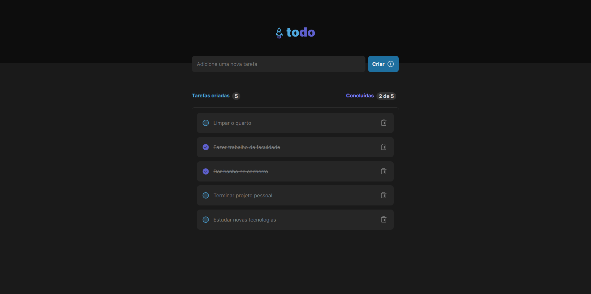

# TodoList Project

Este é um projeto com objetivo de implementar alguns conhecimentos em ReactJS a partir de um design fornecido pela rocketseat no [Figma](https://www.figma.com/file/iA3ZKQpNulC28XbL5CjKzo/ToDo-List-•-Desafio-React-(Copy)?type=design&node-id=0-1&mode=design&t=XH287ySd6zO6m0Cb-0).

### Sobre a aplicação
Nela deve ser permitido: 

- Adicionar uma nova tarefa
- Marcar e desmarcar uma tarefa como concluída
- Remover uma tarefa da listagem
- Mostrar o progresso de conclusão das tarefas

Conceitos abordados para construção da aplicação

- Estados
- Imutabilidade do estado
- Listas e chaves no ReactJS
- Propriedades
- Componentização

